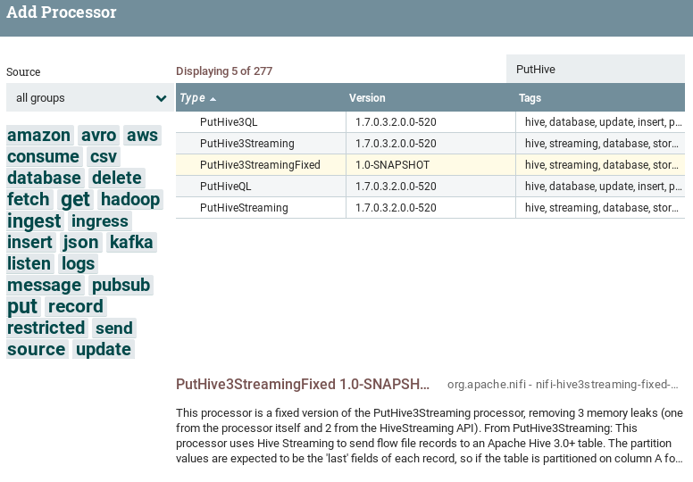

# NiFi Hive3Streaming Fixed

The goal of this project is to provide a stable implementation of the PutHive3Streaming processor, that is currently subject to 3 memory leaks. The fixed processor is named **PutHive3StreamingFixed**.

## Why do you need the PutHive3Streaming processor?

PutHive3Streaming leverages the new [HiveStreaming API](https://cwiki.apache.org/confluence/display/Hive/Streaming+Data+Ingest+V2) to write to Hive 3.0+ tables. Therefore it is needed for ingesting data from NiFi to Hive in HDP (Hortonworks Data Platform) 3.0+ clusters. It is available since [NiFi 1.7.0](https://cwiki.apache.org/confluence/display/NIFI/Release+Notes#ReleaseNotes-Version1.7.0).

## What is wrong with the official implementation?

You might not notice it during testing phases, but there are 2 major data leaks ([HIVE-20979](https://issues.apache.org/jira/browse/HIVE-20979?jql=project%20%3D%20HIVE%20AND%20fixVersion%20%3D%203.1.1)) in the HiveStreaming API that will make your NiFi crash after a given number of flowfile ingested to Hive (depending of the heap size you allocated to NiFi)... And there is also a data leak in the NiFi processor itself ([NIFI-5841](https://issues.apache.org/jira/browse/NIFI-5841))!

The fixes for those 3 memory leaks will eventually be integrated in Hive and NiFi releases, but until now you are on your own. Well, not really because there is this fixed version!

## How did I fix the problem?

I just modified the official implementation to fix the data leaks in NiFi and Hive, and embedded the needed Hive classes with the processor, based on the official pull requests ([NIFI-5841](https://github.com/apache/nifi/pull/3249), [HIVE-20979](https://github.com/apache/hive/pull/495)).

## How to use the fixed processor?

1. Clone this repo:
   ```
   git clone https://github.com/Nuttymoon/nifi-hive3streaming-fixed.git
   ```
2. Edit the `bundle/pom.xml` to match your cluster versions (this is for HDP 3.0.1):
   ```xml
    <properties>
        <hive3.version>3.1.0</hive3.version>
        <hive3.hadoop.version>3.1.1</hive3.hadoop.version>
    </properties>
   ```
3. Build the package with Maven:
   ```
   cd nifi-hive3streaming-fixed/bundle
   mvn clean install
   ```
4. Copy the `nar` file generated to the `$NIFI_PATH/lib/` directory of NiFi nodes. For example, for an HDF (Hortonworks DataFlow) setup:
   ```shell
   scp nifi-hive3streaming-fixed-nar/target/nifi-hive3streaming-fixed-nar-1.0-SNAPSHOT.nar user@nifihost:/usr/hdf/current/nifi/lib
   ```
5. Don't forget to make `nifi` owner of the file:
   ```shell
   ssh user@nifihost "
   chown nifi /usr/hdf/current/nifi/lib/nifi-hive3streaming-fixed-nar-1.0-SNAPSHOT.nar &&
   chgrp nifi !$ &&
   chmod 640 !$"
   ```
6. Restart NiFi
7. You should be able to see the processor in the NiFi Web UI:

   

8. Use this processor instead of PutHive3Streaming, it should keep NiFi from crashing.

## Feedback

Don't hesitate to create an issue if you have any problem!
